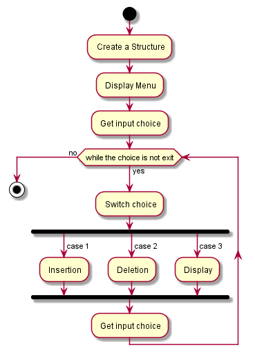

# Single-Linked-List
- Objective:

	To create a Menu driven program using Single Linked List.

The task contains following Directories:

- assets:
	
	Assets are flowchart files. We created our flowchart for the task using Plantuml and stored it here.

- docs:
	
	It contains all the issues we have faced while working on this task. These issue documentation is so much beneficial for future purpose.

- src:
	
	It contains our task's source. We can pull this source and work with it on any required time.

Following is the flowchart for the Task:

Single Linked List Version_v1.0.0
